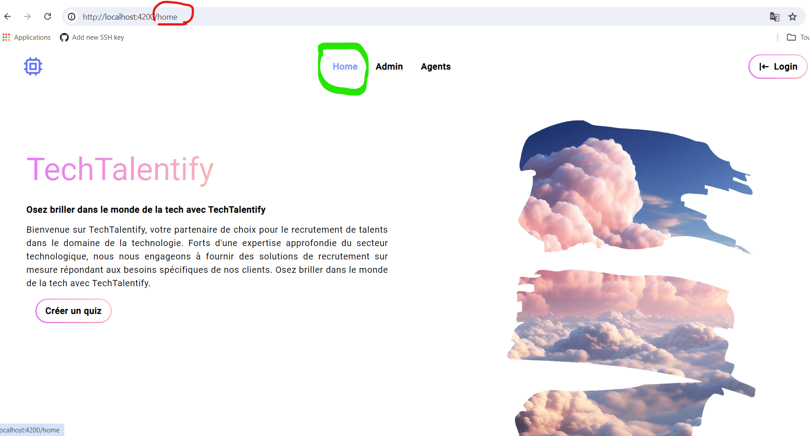
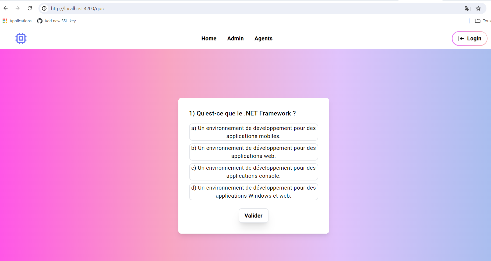
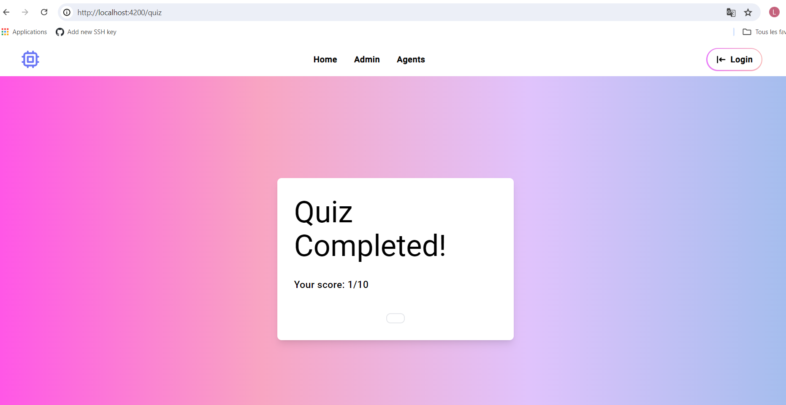

# 📊 Projet AppQuizz

Ce projet est une application web permettant aux recruteurs de générer et d’évaluer des quiz techniques pour les candidats. L’objectif est d’analyser la performance des candidats en fonction du niveau de difficulté des questions et de fournir des résultats détaillés.

## 📌 Description

L'application est développée en **C# avec .NET** pour le backend et **React ou Vue.js** pour le frontend. Elle permet la gestion et l’évaluation des quiz techniques.

- **Gestion des quiz** : Création et personnalisation des quiz en fonction des niveaux de difficulté.
- **Système d’évaluation** : Analyse des résultats avec taux de bonnes réponses global et par niveau de complexité.
- **Base de données** : Stockage des questions, réponses et résultats des candidats.
- **Interface utilisateur** : Formulaire interactif pour répondre aux questions.
- **Génération de rapports** : Exportation des résultats sous format PDF.

## 🛠️ Technologies Utilisées

- **Backend** : C# (.NET 6+)
- **Frontend** : React.js ou Vue.js
- **Base de données** : SQL Server
- **Authentification** : Identity Server / JWT
- **Docker** : Conteneurisation pour faciliter le déploiement
- **Azure App Service** : Hébergement de l’application
- **Entity Framework Core** : Gestion des données

## 🚀 Installation et Exécution

### 1️⃣ Prérequis
- .NET SDK 6+
- Node.js 16+
- SQL Server
- Docker (optionnel)

### 2️⃣ Installation

Cloner le dépôt :
```bash
git clone https://github.com/LamyaaER/AppQuizz.git
cd AppQuizz
```

### 3️⃣ Backend (.NET API)

Accéder au projet backend :
```bash
cd Backend
```
Restaurer les dépendances et exécuter l’API :
```bash
dotnet restore
dotnet run
```
L’API sera accessible sur `http://localhost:5000/`.

### 4️⃣ Frontend (React/Vue.js)

Accéder au projet frontend :
```bash
cd Frontend
```
Installer les dépendances et démarrer l’application :
```bash
npm install
npm run dev
```
L’application sera accessible sur `http://localhost:3000/`.

## 📦 Déploiement avec Docker

Construire et exécuter l’application avec Docker :
```bash
docker-compose up --build
```
L’application sera accessible via `http://localhost:5000`.

## 🚀 Déploiement sur Azure

1. Déployer le backend sur **Azure App Service**.
2. Héberger le frontend sur **Azure Static Web Apps**.
3. Configurer une **base de données SQL Azure**.
4. Déployer avec **GitHub Actions**.

## 📸 Captures d'écran

### Interface principale


### Génération de Quiz


### Interface du Quiz


### Résultat du Quiz


## 📜 Licence

Ce projet est sous licence MIT.

---

👤 **Auteur** : [Lamyaa ER-RECHAKI](https://github.com/LamyaaER)

